```r
require(tidyverse)
```

```
## Loading required package: tidyverse
```

```
## ── Attaching packages ──────────── tidyverse 1.3.2 ──
## ✔ ggplot2 3.4.0      ✔ purrr   0.3.5 
## ✔ tibble  3.1.8      ✔ dplyr   1.0.10
## ✔ tidyr   1.2.1      ✔ stringr 1.5.0 
## ✔ readr   2.1.3      ✔ forcats 0.5.2
```

```
## Warning: package 'ggplot2' was built under R version 4.2.2
```

```
## ── Conflicts ─────────────── tidyverse_conflicts() ──
## ✖ dplyr::filter() masks stats::filter()
## ✖ dplyr::lag()    masks stats::lag()
```

```r
require(car)
```

```
## Loading required package: car
```

```
## Warning: package 'car' was built under R version 4.2.2
```

```
## Loading required package: carData
## 
## Attaching package: 'car'
## 
## The following object is masked from 'package:dplyr':
## 
##     recode
## 
## The following object is masked from 'package:purrr':
## 
##     some
```

```r
require(MASS)
```

```
## Loading required package: MASS
## 
## Attaching package: 'MASS'
## 
## The following object is masked from 'package:dplyr':
## 
##     select
```

```r
require(MuMIn)
```

```
## Loading required package: MuMIn
```

```
## Warning: package 'MuMIn' was built under R version 4.2.2
```

Before doing this, review the ** Combining Multiple Explanatory Variables in Linear Models** lecture set slides from 
https://sites.google.com/view/biostats/lessons/ancova-and-multiple-regression and
the  **10_ANCOVA_and_Regression.R**
script in the lecture files folder of the
[CUNY-BioStats github repository](https://github.com/jsgosnell/CUNY-BioStats). 
Make sure you are comfortable with null and alternative hypotheses and appropriate plots
for all examples.

Remember you should

* add code chunks by clicking the *Insert Chunk* button on the toolbar or by
pressing *Ctrl+Alt+I* to answer the questions!
* **knit** your file to produce a markdown version that you can see!
* save your work often 
  * **commit** it via git!
  * **push** updates to github
  
## Example

Following the iris example from class


```r
set.seed(13)
iris_example_species <-data.frame(
  Species = c(rep("x",25), rep("y", 25), rep("z", 25)),
  Sepal_Length = runif(75,2,4 ),
  #no difference based on species or sepal length
  Petal_no_impacts = runif (75, 4, 6))
#no difference based on species
iris_example_species$Petal_no_impact_species <- 
  iris_example_species$Sepal_Length * 2 + rnorm(75)
#no impact of petal length
iris_example_species$Petal_no_relationship <-rnorm(75) +
  c(rep(2,25), rep(3,25), rep(4,25))
#impact of species and petal length but no interaction
iris_example_species$Petal_no_interaction <- 
  iris_example_species$Sepal_Length * 2 + rnorm(75) +
  c(rep(2,25), rep(3,25), rep(4,25))
#impact of species and petal length with interaction
iris_example_species$Petal_interaction <- 
  iris_example_species$Sepal_Length * c(rep(-2, 25),rep(2,25), rep(5,25)) + 
  c(rep(2,25), rep(3,25), rep(4,25)) + rnorm(75)
```

Plot the data


```r
library(ggplot2)
ggplot(iris_example_species, aes(x = Sepal_Length, y = Petal_interaction, color = Species)) +
  geom_point(size = 3)+
  xlab("Sepal Length") +
  ylab("Petal Length") +
  ggtitle("Impact of Sepal Length and Species on Petal Length") +
  theme(axis.title.x = element_text(face="bold", size=28), 
        axis.title.y = element_text(face="bold", size=28), 
        axis.text.y  = element_text(size=20),
        axis.text.x  = element_text(size=20), 
        legend.text =element_text(size=20),
        legend.title = element_text(size=20, face="bold"),
        plot.title = element_text(hjust = 0.5, face="bold", size=32))
```

<!-- -->

Note the impact of sepal length appears to depend on species.


```r
library(car)
Anova(lm(Petal_interaction ~ Sepal_Length * Species, iris_example_species), 
      type = "III")
```

```
## Anova Table (Type III tests)
## 
## Response: Petal_interaction
##                       Sum Sq Df F value    Pr(>F)    
## (Intercept)            2.096  1  1.6503    0.2032    
## Sepal_Length          28.875  1 22.7307 1.001e-05 ***
## Species                2.920  2  1.1494    0.3228    
## Sepal_Length:Species 159.284  2 62.6954 3.027e-16 ***
## Residuals             87.651 69                      
## ---
## Signif. codes:  0 '***' 0.001 '**' 0.01 '*' 0.05 '.' 0.1 ' ' 1
```

Interaction is significant, so follow up for each species. this ends in regression!


```r
summary(lm(Petal_interaction ~ Sepal_Length, 
         iris_example_species[iris_example_species$Species == "x",]))
```

```
## 
## Call:
## lm(formula = Petal_interaction ~ Sepal_Length, data = iris_example_species[iris_example_species$Species == 
##     "x", ])
## 
## Residuals:
##     Min      1Q  Median      3Q     Max 
## -2.1788 -0.9693  0.2359  0.5302  1.6908 
## 
## Coefficients:
##              Estimate Std. Error t value Pr(>|t|)    
## (Intercept)    1.5724     1.1058   1.422    0.168    
## Sepal_Length  -1.8824     0.3567  -5.277 2.35e-05 ***
## ---
## Signif. codes:  0 '***' 0.001 '**' 0.01 '*' 0.05 '.' 0.1 ' ' 1
## 
## Residual standard error: 1.018 on 23 degrees of freedom
## Multiple R-squared:  0.5477,	Adjusted R-squared:  0.528 
## F-statistic: 27.85 on 1 and 23 DF,  p-value: 2.35e-05
```

Significant negative relationship for species x.


```r
summary(lm(Petal_interaction ~ Sepal_Length, 
           iris_example_species[iris_example_species$Species == "y",]))
```

```
## 
## Call:
## lm(formula = Petal_interaction ~ Sepal_Length, data = iris_example_species[iris_example_species$Species == 
##     "y", ])
## 
## Residuals:
##     Min      1Q  Median      3Q     Max 
## -2.4904 -0.7587  0.2401  0.8115  1.3829 
## 
## Coefficients:
##              Estimate Std. Error t value Pr(>|t|)    
## (Intercept)    3.7147     1.2584   2.952  0.00715 ** 
## Sepal_Length   1.8307     0.4127   4.436  0.00019 ***
## ---
## Signif. codes:  0 '***' 0.001 '**' 0.01 '*' 0.05 '.' 0.1 ' ' 1
## 
## Residual standard error: 1.142 on 23 degrees of freedom
## Multiple R-squared:  0.4611,	Adjusted R-squared:  0.4376 
## F-statistic: 19.68 on 1 and 23 DF,  p-value: 0.00019
```

Positive relationship for species y


```r
summary(lm(Petal_interaction ~ Sepal_Length, 
           iris_example_species[iris_example_species$Species == "z",]))
```

```
## 
## Call:
## lm(formula = Petal_interaction ~ Sepal_Length, data = iris_example_species[iris_example_species$Species == 
##     "z", ])
## 
## Residuals:
##     Min      1Q  Median      3Q     Max 
## -2.4143 -0.5861 -0.1689  0.7747  3.1415 
## 
## Coefficients:
##              Estimate Std. Error t value Pr(>|t|)    
## (Intercept)    4.0916     1.5034   2.722   0.0122 *  
## Sepal_Length   5.1553     0.5402   9.543 1.83e-09 ***
## ---
## Signif. codes:  0 '***' 0.001 '**' 0.01 '*' 0.05 '.' 0.1 ' ' 1
## 
## Residual standard error: 1.213 on 23 degrees of freedom
## Multiple R-squared:  0.7984,	Adjusted R-squared:  0.7896 
## F-statistic: 91.07 on 1 and 23 DF,  p-value: 1.834e-09
```

and z!  

## Practice

### 1
  

1.  Data on FEV (forced expiratory volume), a measure of lung function, can
be found at 

http://www.statsci.org/data/general/fev.txt

More information on the dataset is available at 

http://www.statsci.org/data/general/fev.html.

Does the impact of age on FEV differ among genders? Consider how your answer to 
this differs from the previous assignment!


```r
getwd()
```

```
## [1] "D:/cuny_biotstats_2022"
```


```r
fev <- read.csv(file = 'fev.csv') %>%
  as_tibble()
```


```r
fev
```

```
## # A tibble: 654 × 6
##       ID   Age   FEV Height Sex    Smoker
##    <int> <int> <dbl>  <dbl> <chr>  <chr> 
##  1   301     9  1.71   57   Female Non   
##  2   451     8  1.72   67.5 Female Non   
##  3   501     7  1.72   54.5 Female Non   
##  4   642     9  1.56   53   Male   Non   
##  5   901     9  1.90   57   Male   Non   
##  6  1701     8  2.34   61   Female Non   
##  7  1752     6  1.92   58   Female Non   
##  8  1753     6  1.42   56   Female Non   
##  9  1901     8  1.99   58.5 Female Non   
## 10  1951     9  1.94   60   Female Non   
## # … with 644 more rows
```


```r
ggplot(fev, aes(x = Age, y = FEV, color = Sex)) +
  geom_point(size = 1.5)+
  xlab("Age") +
  ylab("FEV") +
  ggtitle("Impact of age age on FEV differ among genders") +
  theme(axis.title.x = element_text(face = "bold", size = 12), 
        axis.title.y = element_text(face = "bold", size = 12), 
        axis.text.y  = element_text(size = 10),
        axis.text.x  = element_text(size = 10), 
        legend.text =element_text(size = 10),
        legend.title = element_text(size = 10, face= "bold"),
        plot.title = element_text(hjust = 0.5, face= "bold", size = 12))
```

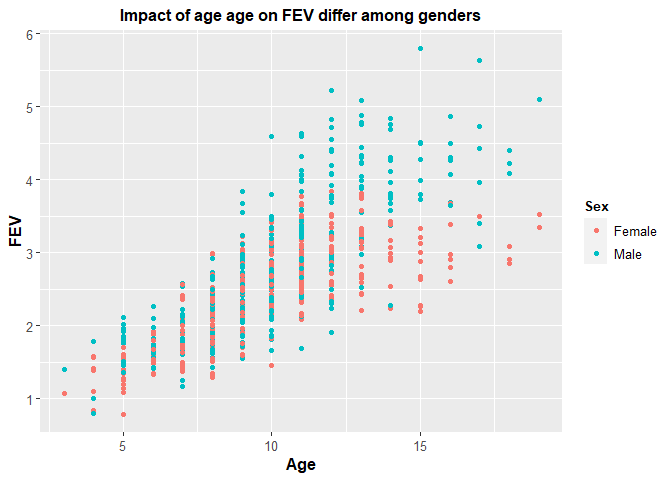<!-- -->


```r
fev1.lm <- lm(FEV ~ Age * Sex, data = fev)
```


```r
c <- coef(lm(FEV ~ Age * Sex, data = fev))
```


```r
c
```

```
## (Intercept)         Age     SexMale Age:SexMale 
##   0.8494671   0.1627289  -0.7758666   0.1107487
```

Write out the fitted regression equation:

FEV = 0.8494671 + 0.1627289(Age) - 0.775866 (Sex - Male) 


```r
summary(fev1.lm)$coefficients
```

```
##               Estimate  Std. Error   t value     Pr(>|t|)
## (Intercept)  0.8494671 0.102199484  8.311853 5.506108e-16
## Age          0.1627289 0.009952211 16.351029 1.359667e-50
## SexMale     -0.7758666 0.142745482 -5.435314 7.744955e-08
## Age:SexMale  0.1107487 0.013786032  8.033401 4.467410e-15
```


```r
# View p-value for points variable

#summary(fev1.lm)$coefficients["points", "Pr(>|t|)"]
```


```r
summary(fev1.lm)$coefficients[, "Pr(>|t|)"]
```

```
##  (Intercept)          Age      SexMale  Age:SexMale 
## 5.506108e-16 1.359667e-50 7.744955e-08 4.467410e-15
```


```r
coef(summary(fev1.lm))[, c("t value","Pr(>|t|)")]
```

```
##               t value     Pr(>|t|)
## (Intercept)  8.311853 5.506108e-16
## Age         16.351029 1.359667e-50
## SexMale     -5.435314 7.744955e-08
## Age:SexMale  8.033401 4.467410e-15
```


```r
summary(fev1.lm)
```

```
## 
## Call:
## lm(formula = FEV ~ Age * Sex, data = fev)
## 
## Residuals:
##      Min       1Q   Median       3Q      Max 
## -1.64072 -0.34337 -0.04934  0.33206  1.86867 
## 
## Coefficients:
##              Estimate Std. Error t value Pr(>|t|)    
## (Intercept)  0.849467   0.102199   8.312 5.51e-16 ***
## Age          0.162729   0.009952  16.351  < 2e-16 ***
## SexMale     -0.775867   0.142745  -5.435 7.74e-08 ***
## Age:SexMale  0.110749   0.013786   8.033 4.47e-15 ***
## ---
## Signif. codes:  0 '***' 0.001 '**' 0.01 '*' 0.05 '.' 0.1 ' ' 1
## 
## Residual standard error: 0.5196 on 650 degrees of freedom
## Multiple R-squared:  0.6425,	Adjusted R-squared:  0.6408 
## F-statistic: 389.4 on 3 and 650 DF,  p-value: < 2.2e-16
```


```r
Anova(fev1.lm, Type = "III")
```

```
## Anova Table (Type II tests)
## 
## Response: FEV
##            Sum Sq  Df  F value    Pr(>F)    
## Age       276.661   1 1024.615 < 2.2e-16 ***
## Sex        17.066   1   63.203 8.270e-15 ***
## Age:Sex    17.426   1   64.535 4.467e-15 ***
## Residuals 175.509 650                       
## ---
## Signif. codes:  0 '***' 0.001 '**' 0.01 '*' 0.05 '.' 0.1 ' ' 1
```


```r
Anova(lm(FEV ~ Age * Sex, fev), 
      type = "III") 
```

```
## Anova Table (Type III tests)
## 
## Response: FEV
##              Sum Sq  Df F value    Pr(>F)    
## (Intercept)  18.654   1  69.087 5.506e-16 ***
## Age          72.190   1 267.356 < 2.2e-16 ***
## Sex           7.977   1  29.543 7.745e-08 ***
## Age:Sex      17.426   1  64.535 4.467e-15 ***
## Residuals   175.509 650                      
## ---
## Signif. codes:  0 '***' 0.001 '**' 0.01 '*' 0.05 '.' 0.1 ' ' 1
```

Interaction is significant, so follow up for male and female. This ends in regression!


```r
summary(lm(FEV ~ Age, 
         fev[fev$Sex == "Male",]))
```

```
## 
## Call:
## lm(formula = FEV ~ Age, data = fev[fev$Sex == "Male", ])
## 
## Residuals:
##      Min       1Q   Median       3Q      Max 
## -1.64072 -0.37752 -0.05318  0.36893  1.86867 
## 
## Coefficients:
##             Estimate Std. Error t value Pr(>|t|)    
## (Intercept)   0.0736     0.1128   0.653    0.514    
## Age           0.2735     0.0108  25.329   <2e-16 ***
## ---
## Signif. codes:  0 '***' 0.001 '**' 0.01 '*' 0.05 '.' 0.1 ' ' 1
## 
## Residual standard error: 0.5881 on 334 degrees of freedom
## Multiple R-squared:  0.6576,	Adjusted R-squared:  0.6566 
## F-statistic: 641.6 on 1 and 334 DF,  p-value: < 2.2e-16
```


```r
summary(lm(FEV ~ Age, 
         fev[fev$Sex == "Female",]))
```

```
## 
## Call:
## lm(formula = FEV ~ Age, data = fev[fev$Sex == "Female", ])
## 
## Residuals:
##      Min       1Q   Median       3Q      Max 
## -1.09240 -0.28991 -0.03762  0.28749  1.13451 
## 
## Coefficients:
##             Estimate Std. Error t value Pr(>|t|)    
## (Intercept) 0.849467   0.085695   9.913   <2e-16 ***
## Age         0.162729   0.008345  19.500   <2e-16 ***
## ---
## Signif. codes:  0 '***' 0.001 '**' 0.01 '*' 0.05 '.' 0.1 ' ' 1
## 
## Residual standard error: 0.4357 on 316 degrees of freedom
## Multiple R-squared:  0.5461,	Adjusted R-squared:  0.5447 
## F-statistic: 380.3 on 1 and 316 DF,  p-value: < 2.2e-16
```

### 2

2. Data on home gas consumption at various temperatures before and after new insulation was installed has been collected @ 

http://www.statsci.org/data/general/insulgas.txt

More information on the data is available @

http://www.statsci.org/data/general/insulgas.html

Is there any relationship between these factors?  How would you test this,
and what type of plot would you produce to accompany your analysis?


```r
insulgas <- read.csv(file = 'insulgas.csv') %>%
  as_tibble()
```


```r
insulgas
```

```
## # A tibble: 44 × 3
##    Insulate  Temp   Gas
##    <chr>    <dbl> <dbl>
##  1 Before    -0.8   7.2
##  2 Before    -0.7   6.9
##  3 Before     0.4   6.4
##  4 Before     2.5   6  
##  5 Before     2.9   5.8
##  6 Before     3.2   5.8
##  7 Before     3.6   5.6
##  8 Before     3.9   4.7
##  9 Before     4.2   5.8
## 10 Before     4.3   5.2
## # … with 34 more rows
```


```r
ggplot(insulgas, aes(x = Temp, y = Gas, color = Insulate)) +
  geom_point(size = 1.5)+
  ylab(expression(paste("Gas (1000 ",ft^3, ")")))+
  xlab(expression(paste("Temperature (", degree~C, ")")))+
  geom_smooth(method = "lm", se = F) +
  #xlab("Temp") +
  #ylab("Gas") +
  ggtitle("Impact of Temp on Gas before vs. after Insulate") +
  theme(axis.title.x = element_text(face = "bold", size = 12), 
        axis.title.y = element_text(face = "bold", size = 12), 
        axis.text.y  = element_text(size = 10),
        axis.text.x  = element_text(size = 10), 
        legend.text =element_text(size = 10),
        legend.title = element_text(size = 10, face= "bold"),
        plot.title = element_text(hjust = 0.5, face= "bold", size = 12))
```

```
## `geom_smooth()` using formula = 'y ~ x'
```

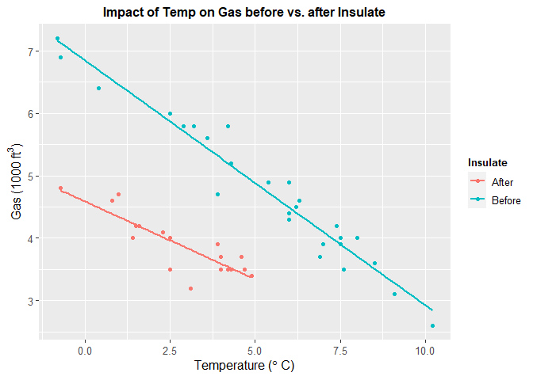<!-- -->


```r
insulgas1.lm <- lm(Gas ~ Temp * Insulate, data = insulgas)
```


```r
insulgas.c <- coef(lm(Gas ~ Temp * Insulate, data = insulgas))
```


```r
insulgas.c
```

```
##         (Intercept)                Temp      InsulateBefore Temp:InsulateBefore 
##           4.5906175          -0.2496268           2.2632102          -0.1436120
```

Write out the fitted regression equation:

FEV = 4.5906175 + 2.2632102(Before) - 0.1436120 (Temp - Before) 


```r
summary(insulgas1.lm)$coefficients
```

```
##                       Estimate Std. Error   t value     Pr(>|t|)
## (Intercept)          4.5906175 0.13015969 35.269120 9.445821e-32
## Temp                -0.2496268 0.04039318 -6.179924 2.639691e-07
## InsulateBefore       2.2632102 0.17277759 13.098980 4.708609e-16
## Temp:InsulateBefore -0.1436120 0.04455066 -3.223567 2.521247e-03
```


```r
summary(insulgas1.lm)$coefficients[, "Pr(>|t|)"]
```

```
##         (Intercept)                Temp      InsulateBefore Temp:InsulateBefore 
##        9.445821e-32        2.639691e-07        4.708609e-16        2.521247e-03
```


```r
coef(summary(insulgas1.lm))[, c("t value","Pr(>|t|)")]
```

```
##                       t value     Pr(>|t|)
## (Intercept)         35.269120 9.445821e-32
## Temp                -6.179924 2.639691e-07
## InsulateBefore      13.098980 4.708609e-16
## Temp:InsulateBefore -3.223567 2.521247e-03
```


```r
summary(insulgas1.lm)
```

```
## 
## Call:
## lm(formula = Gas ~ Temp * Insulate, data = insulgas)
## 
## Residuals:
##      Min       1Q   Median       3Q      Max 
## -0.62020 -0.18011  0.03405  0.16379  0.59778 
## 
## Coefficients:
##                     Estimate Std. Error t value Pr(>|t|)    
## (Intercept)          4.59062    0.13016  35.269  < 2e-16 ***
## Temp                -0.24963    0.04039  -6.180 2.64e-07 ***
## InsulateBefore       2.26321    0.17278  13.099 4.71e-16 ***
## Temp:InsulateBefore -0.14361    0.04455  -3.224  0.00252 ** 
## ---
## Signif. codes:  0 '***' 0.001 '**' 0.01 '*' 0.05 '.' 0.1 ' ' 1
## 
## Residual standard error: 0.2699 on 40 degrees of freedom
## Multiple R-squared:  0.9359,	Adjusted R-squared:  0.9311 
## F-statistic: 194.8 on 3 and 40 DF,  p-value: < 2.2e-16
```

*There is a significant relationship between insulation type (before/after) and
temperature on gas usage (F~1,40~=10.39, p<.01). Graphical analysis indicates the old (before) insulation led to higher overall gas usage and gas usage increased faster with colder temperature compared to the new insulation. Statistical analysis bears this out*


```r
Anova(insulgas1.lm, Type = "III")
```

```
## Anova Table (Type II tests)
## 
## Response: Gas
##               Sum Sq Df F value    Pr(>F)    
## Temp          33.931  1 465.676 < 2.2e-16 ***
## Insulate      26.906  1 369.266 < 2.2e-16 ***
## Temp:Insulate  0.757  1  10.391  0.002521 ** 
## Residuals      2.915 40                      
## ---
## Signif. codes:  0 '***' 0.001 '**' 0.01 '*' 0.05 '.' 0.1 ' ' 1
```


```r
Anova(lm(Gas ~ Temp * Insulate, insulgas), 
      type = "III") 
```

```
## Anova Table (Type III tests)
## 
## Response: Gas
##               Sum Sq Df  F value    Pr(>F)    
## (Intercept)   90.636  1 1243.911 < 2.2e-16 ***
## Temp           2.783  1   38.191 2.640e-07 ***
## Insulate      12.502  1  171.583 4.709e-16 ***
## Temp:Insulate  0.757  1   10.391  0.002521 ** 
## Residuals      2.915 40                       
## ---
## Signif. codes:  0 '***' 0.001 '**' 0.01 '*' 0.05 '.' 0.1 ' ' 1
```

Interaction is significant, so follow up for male and female. This ends in regression!


```r
before <- lm(Gas ~ Temp * Insulate, insulgas)
```


```r
plot(before)
```

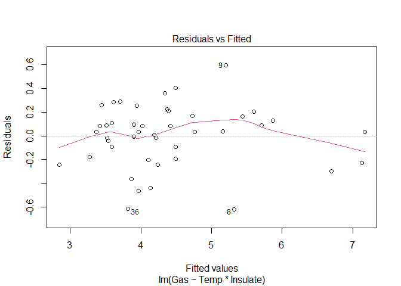<!-- -->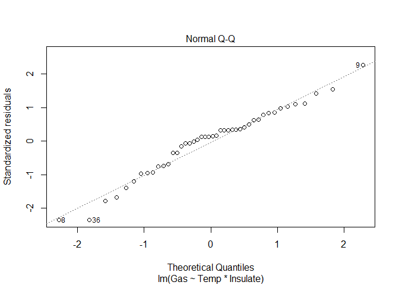<!-- -->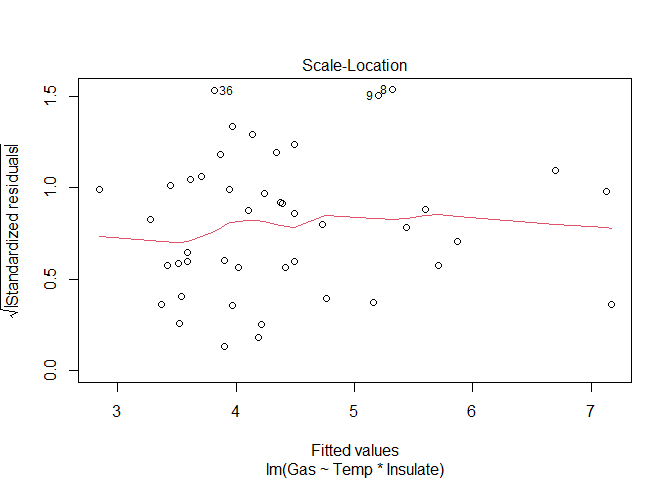<!-- -->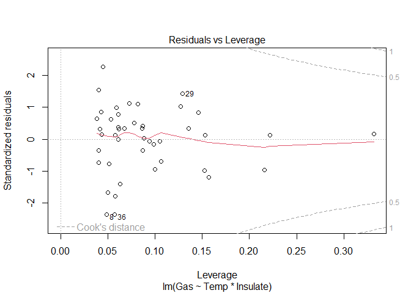<!-- -->


```r
summary(lm(Gas ~ Temp, 
         insulgas[insulgas$Insulate == "Before",]))
```

```
## 
## Call:
## lm(formula = Gas ~ Temp, data = insulgas[insulgas$Insulate == 
##     "Before", ])
## 
## Residuals:
##      Min       1Q   Median       3Q      Max 
## -0.62020 -0.19947  0.06068  0.16770  0.59778 
## 
## Coefficients:
##             Estimate Std. Error t value Pr(>|t|)    
## (Intercept)  6.85383    0.11842   57.88   <2e-16 ***
## Temp        -0.39324    0.01959  -20.08   <2e-16 ***
## ---
## Signif. codes:  0 '***' 0.001 '**' 0.01 '*' 0.05 '.' 0.1 ' ' 1
## 
## Residual standard error: 0.2813 on 24 degrees of freedom
## Multiple R-squared:  0.9438,	Adjusted R-squared:  0.9415 
## F-statistic: 403.1 on 1 and 24 DF,  p-value: < 2.2e-16
```


```r
summary(lm(Gas ~ Temp, 
         insulgas[insulgas$Insulate == "After",]))
```

```
## 
## Call:
## lm(formula = Gas ~ Temp, data = insulgas[insulgas$Insulate == 
##     "After", ])
## 
## Residuals:
##      Min       1Q   Median       3Q      Max 
## -0.61677 -0.03594  0.03300  0.10180  0.35901 
## 
## Coefficients:
##             Estimate Std. Error t value Pr(>|t|)    
## (Intercept)  4.59062    0.12145  37.799  < 2e-16 ***
## Temp        -0.24963    0.03769  -6.623 5.86e-06 ***
## ---
## Signif. codes:  0 '***' 0.001 '**' 0.01 '*' 0.05 '.' 0.1 ' ' 1
## 
## Residual standard error: 0.2519 on 16 degrees of freedom
## Multiple R-squared:  0.7327,	Adjusted R-squared:  0.716 
## F-statistic: 43.87 on 1 and 16 DF,  p-value: 5.857e-06
```

Look at the `Estimate` column for each model to get the slope of the line.

*There is a significant relationship between gas usage and temperature for old 
and new insulation homes. However, the old insulation led to using 400 ft^3^ more gas per week to heat the house with every degree drop in temperature, while the new insulation leads to a increase of only250 ft^3^ more gas per week with each degree drop.*  


```r
insulgas_summary1 <-
as_tibble(insulgas) %>%
  mutate_at(vars(Insulate), factor) %>%
  group_by(Insulate) %>%
  summarise(temp_mean = mean(Temp),
            temp_sd = sd(Temp),
            n = n(),
            temp_se = temp_sd / sqrt(n)
  )
```


```r
insulgas_summary1
```

```
## # A tibble: 2 × 5
##   Insulate temp_mean temp_sd     n temp_se
##   <fct>        <dbl>   <dbl> <int>   <dbl>
## 1 After         2.81    1.62    18   0.382
## 2 Before        5.35    2.87    26   0.563
```


```r
insulgas.barplot1 <- ggplot(insulgas_summary1, aes(x = Insulate, y = temp_mean, fill = Insulate)) +   
  geom_bar(stat = "identity", width = 0.75, color = "#2b2b2b", linewidth = 0.50, alpha = 0.6) +
  geom_linerange(aes(ymin = temp_mean - temp_se, ymax = temp_mean + temp_se), linewidth = 0.75) +
  #ylab(expression(paste("Gas (1000 ",ft^3, ")")))+
  #xlab(expression(paste("Temperature (", degree~C, ")")))+
  #geom_smooth(method = "lm", se = F) +
  scale_y_continuous(expression(paste("Temperature")), limits = c(0, 10)) + 
  scale_x_discrete(expand = c(0, 1)
                   #, 
                   #labels = x_labels
                   ) + 
#  scale_fill_manual(breaks = c("North", "West",
#                               "Southeast"),
#                    values = c("red", "blue", 
#                               "green"), 
#                    labels = c("North", "West",
#                               "Southeast")) +
#  facet_wrap( ~ Insulate, labeller = as_labeller(label_names), dir = "v", ncol = 1) + 
  ggtitle(expression(paste(italic(" Response Varibale: Temperature")))) +
  #scale_y_log10(expression(paste("Colony Size (", cm^2, ")"), limits = c(0, 100000))) +
  labs(x = NULL) +
  theme(#strip.text = element_text(size = 10, color = "black", hjust = 0.50),
        #strip.background = element_rect(fill = "#FFFFFF", color = NA),    
        #panel.background = element_rect(fill = "#FFFFFF", color = NA),
        #panel.grid.major.x = element_blank(),
        #panel.grid.minor.x = element_blank(),
        #panel.grid.minor.y = element_blank(),
        #panel.grid.major.y = element_line(color = "#b2b2b2"),
        #panel.spacing.x = unit(1, "cm"),
        #panel.spacing.y = unit(0.5, "cm"),
        #panel.spacing = unit(1, "lines"),
        axis.ticks = element_blank(),
        #legend.position = "top",
        plot.title = element_text(size = 11),
        axis.title.y = element_text(size = 11),
        legend.title = element_blank()
        )
```


```r
insulgas.barplot1 
```

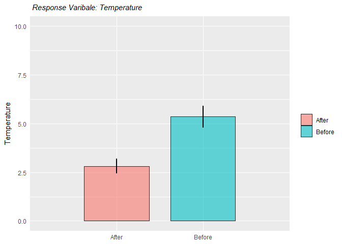<!-- -->


```r
insulgas_summary2 <-
as_tibble(insulgas) %>%
  mutate_at(vars(Insulate), factor) %>%
  group_by(Insulate) %>%
  summarise(gas_mean = mean(Gas),
            gas_sd = sd(Gas),
            n = n(),
            gas_se = gas_sd / sqrt(n)
  )
```


```r
insulgas_summary2
```

```
## # A tibble: 2 × 5
##   Insulate gas_mean gas_sd     n gas_se
##   <fct>       <dbl>  <dbl> <int>  <dbl>
## 1 After        3.89  0.473    18  0.111
## 2 Before       4.75  1.16     26  0.228
```


```r
insulgas.barplot2 <- ggplot(insulgas_summary2, aes(x = Insulate, y = gas_mean, fill = Insulate)) +   
  geom_bar(stat = "identity", width = 0.75, color = "#2b2b2b", linewidth = 0.50, alpha = 0.6) +
  geom_linerange(aes(ymin = gas_mean - gas_se, ymax = gas_mean + gas_se), linewidth = 0.75) +
  scale_y_continuous(expression(paste("Gas")), limits = c(0, 10)) + 
  scale_x_discrete(expand = c(0, 1)
                   #, 
                   #labels = x_labels
                   ) + 
#  scale_fill_manual(breaks = c("North", "West",
#                               "Southeast"),
#                    values = c("red", "blue", 
#                               "green"), 
#                    labels = c("North", "West",
#                               "Southeast")) +
#  facet_wrap( ~ Insulate, labeller = as_labeller(label_names), dir = "v", ncol = 1) + 
  ggtitle(expression(paste(italic(" Response Varibale: Gas")))) +
  #scale_y_log10(expression(paste("Colony Size (", cm^2, ")"), limits = c(0, 100000))) +
  labs(x = NULL) +
  theme(#strip.text = element_text(size = 10, color = "black", hjust = 0.50),
        #strip.background = element_rect(fill = "#FFFFFF", color = NA),    
        #panel.background = element_rect(fill = "#FFFFFF", color = NA),
        #panel.grid.major.x = element_blank(),
        #panel.grid.minor.x = element_blank(),
        #panel.grid.minor.y = element_blank(),
        #panel.grid.major.y = element_line(color = "#b2b2b2"),
        #panel.spacing.x = unit(1, "cm"),
        #panel.spacing.y = unit(0.5, "cm"),
        #panel.spacing = unit(1, "lines"),
        axis.ticks = element_blank(),
        #legend.position = "top",
        plot.title = element_text(size = 11),
        axis.title.y = element_text(size = 11),
        legend.title = element_blank()
        )
```


```r
insulgas.barplot2
```

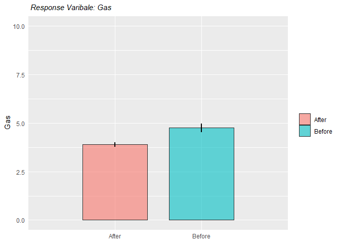<!-- -->

### 3

3.  Data on the height, diameter, and volume of cherry trees was collected for
use in developing an optimal model to predict timber volume.  Data is available @ 

http://www.statsci.org/data/general/cherry.txt

Use the data to justify an optimal model.


```r
cherry <- read.csv(file = 'cherry.csv') %>%
  as_tibble()
```


```r
cherry
```

```
## # A tibble: 31 × 3
##     Diam Height Volume
##    <dbl>  <int>  <dbl>
##  1   8.3     70   10.3
##  2   8.6     65   10.3
##  3   8.8     63   10.2
##  4  10.5     72   16.4
##  5  10.7     81   18.8
##  6  10.8     83   19.7
##  7  11       66   15.6
##  8  11       75   18.2
##  9  11.1     80   22.6
## 10  11.2     75   19.9
## # … with 21 more rows
```

Interaction


```r
cherry.lm <- lm(Volume ~ Height * Diam, data = cherry)
```


```r
plot(cherry.lm)
```

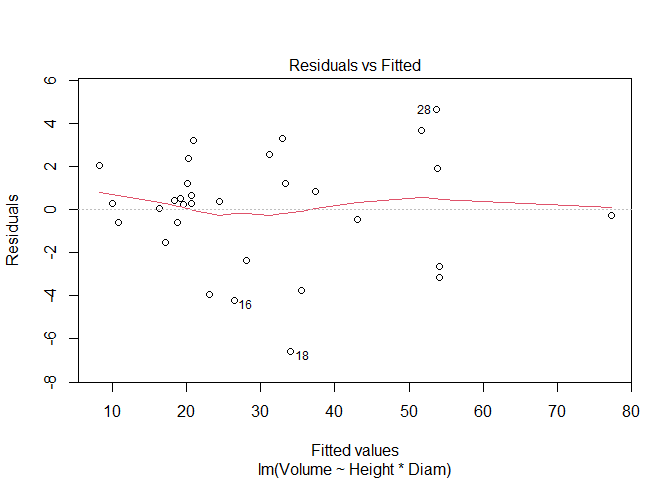<!-- -->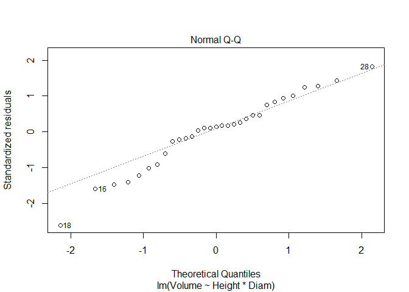<!-- -->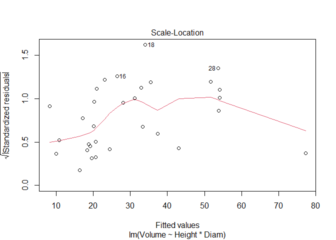<!-- -->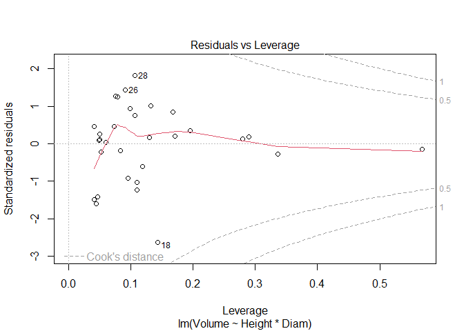<!-- -->


```r
summary(cherry.lm)
```

```
## 
## Call:
## lm(formula = Volume ~ Height * Diam, data = cherry)
## 
## Residuals:
##     Min      1Q  Median      3Q     Max 
## -6.5821 -1.0673  0.3026  1.5641  4.6649 
## 
## Coefficients:
##             Estimate Std. Error t value Pr(>|t|)    
## (Intercept) 69.39632   23.83575   2.911  0.00713 ** 
## Height      -1.29708    0.30984  -4.186  0.00027 ***
## Diam        -5.85585    1.92134  -3.048  0.00511 ** 
## Height:Diam  0.13465    0.02438   5.524 7.48e-06 ***
## ---
## Signif. codes:  0 '***' 0.001 '**' 0.01 '*' 0.05 '.' 0.1 ' ' 1
## 
## Residual standard error: 2.709 on 27 degrees of freedom
## Multiple R-squared:  0.9756,	Adjusted R-squared:  0.9728 
## F-statistic: 359.3 on 3 and 27 DF,  p-value: < 2.2e-16
```


```r
Anova(cherry.lm, Type = "III")
```

```
## Anova Table (Type II tests)
## 
## Response: Volume
##             Sum Sq Df F value    Pr(>F)    
## Height       102.4  1  13.956 0.0008867 ***
## Diam        4783.0  1 651.965 < 2.2e-16 ***
## Height:Diam  223.8  1  30.512 7.484e-06 ***
## Residuals    198.1 27                      
## ---
## Signif. codes:  0 '***' 0.001 '**' 0.01 '*' 0.05 '.' 0.1 ' ' 1
```

No interaction


```r
cherry.lm2 <- lm(Volume ~ Height + Diam, data = cherry)
```


```r
plot(cherry.lm2)
```

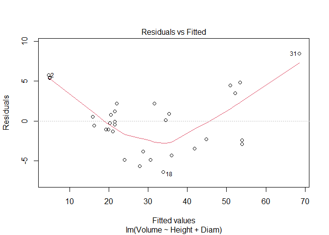<!-- -->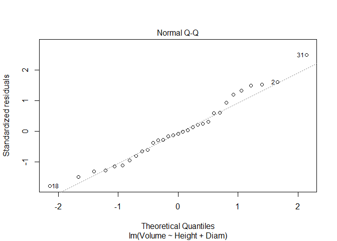<!-- -->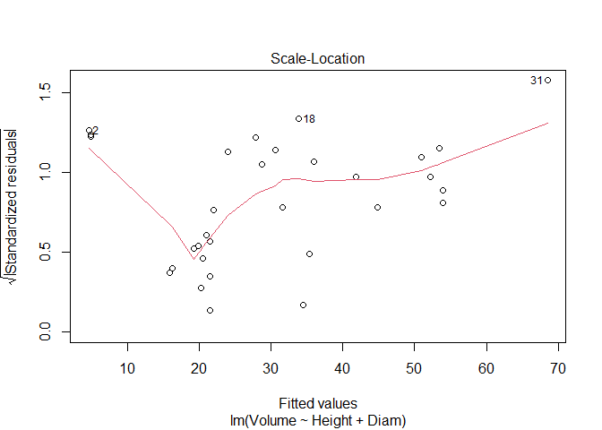<!-- -->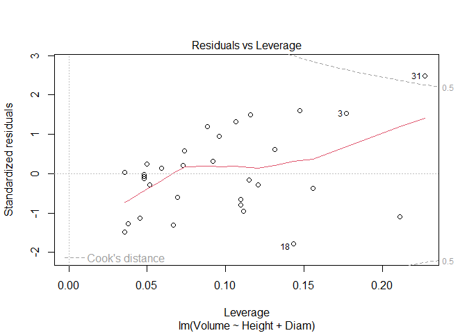<!-- -->


```r
summary(cherry.lm2)
```

```
## 
## Call:
## lm(formula = Volume ~ Height + Diam, data = cherry)
## 
## Residuals:
##     Min      1Q  Median      3Q     Max 
## -6.4065 -2.6493 -0.2876  2.2003  8.4847 
## 
## Coefficients:
##             Estimate Std. Error t value Pr(>|t|)    
## (Intercept) -57.9877     8.6382  -6.713 2.75e-07 ***
## Height        0.3393     0.1302   2.607   0.0145 *  
## Diam          4.7082     0.2643  17.816  < 2e-16 ***
## ---
## Signif. codes:  0 '***' 0.001 '**' 0.01 '*' 0.05 '.' 0.1 ' ' 1
## 
## Residual standard error: 3.882 on 28 degrees of freedom
## Multiple R-squared:  0.948,	Adjusted R-squared:  0.9442 
## F-statistic:   255 on 2 and 28 DF,  p-value: < 2.2e-16
```


```r
Anova(cherry.lm2, Type = "III")
```

```
## Anova Table (Type II tests)
## 
## Response: Volume
##           Sum Sq Df  F value  Pr(>F)    
## Height     102.4  1   6.7943 0.01449 *  
## Diam      4783.0  1 317.4129 < 2e-16 ***
## Residuals  421.9 28                     
## ---
## Signif. codes:  0 '***' 0.001 '**' 0.01 '*' 0.05 '.' 0.1 ' ' 1
```


```r
stepAIC(cherry.lm)
```

```
## Start:  AIC=65.49
## Volume ~ Height * Diam
## 
##               Df Sum of Sq    RSS    AIC
## <none>                     198.08 65.495
## - Height:Diam  1    223.84 421.92 86.936
```

```
## 
## Call:
## lm(formula = Volume ~ Height * Diam, data = cherry)
## 
## Coefficients:
## (Intercept)       Height         Diam  Height:Diam  
##     69.3963      -1.2971      -5.8558       0.1347
```


### 4

4.  Over the course of five years, a professor asked students in his stats class 
to carry out a simple experiment.  Students were asked to measure their pulse 
rate, run for one minute, then measure their pulse rate again.  The students 
also filled out a questionnaire.  Data  include:

Variable | Description
:-:  | :-:
Height | Height (cm)
Weight | Weight (kg)
Age    | Age (years)
Gender | Sex (1 = male, 2 = female)
Smokes | Regular smoker? (1 = yes, 2 = no)
Alcohol | Regular drinker? (1 = yes, 2 = no)
Exercise | Frequency of exercise (1 = high, 2 = moderate, 3 = low)
Change | Percent change in pulse (pulse after experiment/pulse before experiment)
Year | Year of class (93 - 98)

Using the available data (available at 

https://docs.google.com/spreadsheets/d/e/2PACX-1vToN77M80enimQglwpFroooLzDtcQMh4qKbOuhbu-eVmU9buczh7nVV1BdI4T_ma-PfWUnQYmq-60RZ/pub?gid=942311716&single=true&output=csv )

determine the optimal subset of explanatory variables that should be used to
predict change pulse rate (Change) (focusing on main effects only, no 
interactions) and explain your choice of methods.  Interpret your results. Make
sure you can explain any changes you needed to make to the dataset or steps you 
used in your analysis.


```r
pulse <- read.csv(file = 'pulse_class.csv') %>%
  as_tibble()
```


```r
pulse
```

```
## # A tibble: 46 × 9
##    Height Weight   Age Gender Smokes Alcohol Exercise  Year Change
##     <int>  <dbl> <int>  <int>  <int>   <int>    <int> <int>  <dbl>
##  1    179     58    19      2      2       1        2    93  0.829
##  2    167     62    18      2      2       1        1    93  0.833
##  3    184     74    22      1      2       1        3    93  0.808
##  4    168     60    23      1      2       1        2    93  0.705
##  5    170     75    20      1      2       1        1    93  0.158
##  6    180     70    18      1      2       1        2    93  0.825
##  7    140     50    34      2      2       2        3    93  0.4  
##  8    177     74    18      2      2       2        2    93  0.371
##  9    189     60    19      1      2       1        2    95  1.15 
## 10    178     56    21      2      2       1        2    95  0.744
## # … with 36 more rows
```


```r
pulse.tbl <-
  pulse %>%
  mutate_at(vars(Gender, Smokes, Alcohol, Exercise), factor)
```


```r
pulse.tbl
```

```
## # A tibble: 46 × 9
##    Height Weight   Age Gender Smokes Alcohol Exercise  Year Change
##     <int>  <dbl> <int> <fct>  <fct>  <fct>   <fct>    <int>  <dbl>
##  1    179     58    19 2      2      1       2           93  0.829
##  2    167     62    18 2      2      1       1           93  0.833
##  3    184     74    22 1      2      1       3           93  0.808
##  4    168     60    23 1      2      1       2           93  0.705
##  5    170     75    20 1      2      1       1           93  0.158
##  6    180     70    18 1      2      1       2           93  0.825
##  7    140     50    34 2      2      2       3           93  0.4  
##  8    177     74    18 2      2      2       2           93  0.371
##  9    189     60    19 1      2      1       2           95  1.15 
## 10    178     56    21 2      2      1       2           95  0.744
## # … with 36 more rows
```


```r
pulse.lm1 <- lm(Change ~ Height + Weight + Age + Gender + Smokes + Alcohol + Exercise + Year, pulse.tbl)
```


```r
summary(pulse.lm1)
```

```
## 
## Call:
## lm(formula = Change ~ Height + Weight + Age + Gender + Smokes + 
##     Alcohol + Exercise + Year, data = pulse.tbl)
## 
## Residuals:
##      Min       1Q   Median       3Q      Max 
## -0.62704 -0.14035  0.03703  0.17032  0.96692 
## 
## Coefficients:
##              Estimate Std. Error t value Pr(>|t|)
## (Intercept) -0.462261   3.352228  -0.138    0.891
## Height       0.004829   0.003253   1.485    0.146
## Weight       0.002053   0.004907   0.418    0.678
## Age         -0.005816   0.019355  -0.300    0.766
## Gender2      0.022711   0.133969   0.170    0.866
## Smokes2     -0.053951   0.214708  -0.251    0.803
## Alcohol2     0.201692   0.127637   1.580    0.123
## Exercise2   -0.089464   0.153983  -0.581    0.565
## Exercise3   -0.133686   0.170874  -0.782    0.439
## Year         0.004014   0.032617   0.123    0.903
## 
## Residual standard error: 0.3335 on 36 degrees of freedom
## Multiple R-squared:  0.1337,	Adjusted R-squared:  -0.08292 
## F-statistic: 0.6171 on 9 and 36 DF,  p-value: 0.7744
```


```r
pulse.lm2 <- lm(Change ~ ., pulse.tbl)
```


```r
par(mfrow = c(2, 2))
plot(pulse.lm1)
```

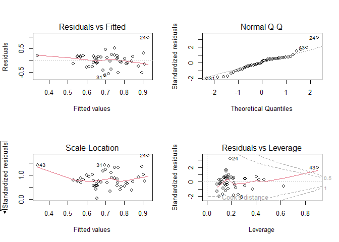<!-- -->


```r
summary(pulse.lm2)
```

```
## 
## Call:
## lm(formula = Change ~ ., data = pulse.tbl)
## 
## Residuals:
##      Min       1Q   Median       3Q      Max 
## -0.62704 -0.14035  0.03703  0.17032  0.96692 
## 
## Coefficients:
##              Estimate Std. Error t value Pr(>|t|)
## (Intercept) -0.462261   3.352228  -0.138    0.891
## Height       0.004829   0.003253   1.485    0.146
## Weight       0.002053   0.004907   0.418    0.678
## Age         -0.005816   0.019355  -0.300    0.766
## Gender2      0.022711   0.133969   0.170    0.866
## Smokes2     -0.053951   0.214708  -0.251    0.803
## Alcohol2     0.201692   0.127637   1.580    0.123
## Exercise2   -0.089464   0.153983  -0.581    0.565
## Exercise3   -0.133686   0.170874  -0.782    0.439
## Year         0.004014   0.032617   0.123    0.903
## 
## Residual standard error: 0.3335 on 36 degrees of freedom
## Multiple R-squared:  0.1337,	Adjusted R-squared:  -0.08292 
## F-statistic: 0.6171 on 9 and 36 DF,  p-value: 0.7744
```


```r
Anova(pulse.lm2, Type = "III")
```

```
## Anova Table (Type II tests)
## 
## Response: Change
##           Sum Sq Df F value Pr(>F)
## Height    0.2451  1  2.2039 0.1464
## Weight    0.0195  1  0.1750 0.6781
## Age       0.0100  1  0.0903 0.7656
## Gender    0.0032  1  0.0287 0.8663
## Smokes    0.0070  1  0.0631 0.8030
## Alcohol   0.2777  1  2.4970 0.1228
## Exercise  0.0681  2  0.3061 0.7382
## Year      0.0017  1  0.0151 0.9027
## Residuals 4.0042 36
```


```r
pulse_final <- step(pulse.lm2)
```

```
## Start:  AIC=-92.3
## Change ~ Height + Weight + Age + Gender + Smokes + Alcohol + 
##     Exercise + Year
## 
##            Df Sum of Sq    RSS     AIC
## - Exercise  2  0.068089 4.0723 -95.524
## - Year      1  0.001684 4.0059 -94.280
## - Gender    1  0.003196 4.0074 -94.263
## - Smokes    1  0.007023 4.0112 -94.219
## - Age       1  0.010041 4.0143 -94.184
## - Weight    1  0.019470 4.0237 -94.076
## <none>                  4.0042 -92.300
## - Height    1  0.245140 4.2494 -91.566
## - Alcohol   1  0.277740 4.2820 -91.215
## 
## Step:  AIC=-95.52
## Change ~ Height + Weight + Age + Gender + Smokes + Alcohol + 
##     Year
## 
##           Df Sum of Sq    RSS     AIC
## - Year     1  0.000084 4.0724 -97.523
## - Gender   1  0.000259 4.0726 -97.521
## - Smokes   1  0.001479 4.0738 -97.507
## - Age      1  0.013292 4.0856 -97.374
## - Weight   1  0.024961 4.0973 -97.243
## <none>                 4.0723 -95.524
## - Height   1  0.243036 4.3153 -94.857
## - Alcohol  1  0.248335 4.3206 -94.801
## 
## Step:  AIC=-97.52
## Change ~ Height + Weight + Age + Gender + Smokes + Alcohol
## 
##           Df Sum of Sq    RSS     AIC
## - Gender   1  0.000260 4.0726 -99.520
## - Smokes   1  0.001714 4.0741 -99.504
## - Age      1  0.013888 4.0863 -99.366
## - Weight   1  0.025500 4.0979 -99.236
## <none>                 4.0724 -97.523
## - Height   1  0.247312 4.3197 -96.811
## - Alcohol  1  0.251305 4.3237 -96.768
## 
## Step:  AIC=-99.52
## Change ~ Height + Weight + Age + Smokes + Alcohol
## 
##           Df Sum of Sq    RSS      AIC
## - Smokes   1  0.001923 4.0746 -101.498
## - Age      1  0.013777 4.0864 -101.365
## - Weight   1  0.035710 4.1084 -101.118
## <none>                 4.0726  -99.520
## - Height   1  0.253293 4.3259  -98.745
## - Alcohol  1  0.267203 4.3399  -98.597
## 
## Step:  AIC=-101.5
## Change ~ Height + Weight + Age + Alcohol
## 
##           Df Sum of Sq    RSS     AIC
## - Age      1  0.013324 4.0879 -103.35
## - Weight   1  0.034915 4.1095 -103.11
## <none>                 4.0746 -101.50
## - Height   1  0.251418 4.3260 -100.74
## - Alcohol  1  0.270349 4.3449 -100.54
## 
## Step:  AIC=-103.35
## Change ~ Height + Weight + Alcohol
## 
##           Df Sum of Sq    RSS     AIC
## - Weight   1  0.037859 4.1258 -104.92
## <none>                 4.0879 -103.35
## - Alcohol  1  0.257733 4.3456 -102.54
## - Height   1  0.265875 4.3538 -102.45
## 
## Step:  AIC=-104.92
## Change ~ Height + Alcohol
## 
##           Df Sum of Sq    RSS     AIC
## <none>                 4.1258 -104.92
## - Alcohol  1   0.25346 4.3792 -104.18
## - Height   1   0.43164 4.5574 -102.35
```


```r
#consider assumptions
plot(pulse_final)
```

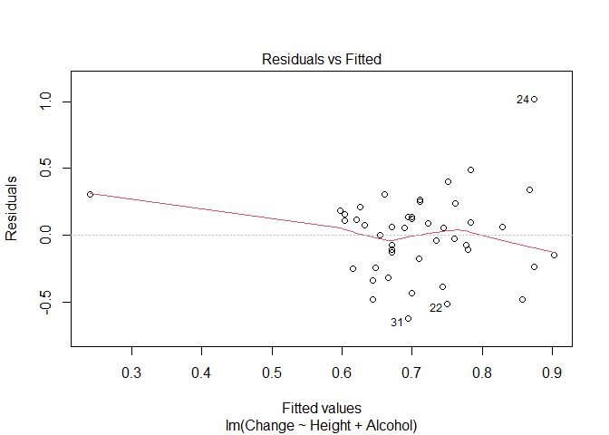<!-- --><!-- --><!-- --><!-- -->


```r
Anova(pulse_final, type = "III")
```

```
## Anova Table (Type III tests)
## 
## Response: Change
##             Sum Sq Df F value  Pr(>F)  
## (Intercept) 0.0434  1  0.4520 0.50500  
## Height      0.4316  1  4.4987 0.03973 *
## Alcohol     0.2535  1  2.6416 0.11141  
## Residuals   4.1258 43                  
## ---
## Signif. codes:  0 '***' 0.001 '**' 0.01 '*' 0.05 '.' 0.1 ' ' 1
```


```r
summary(pulse_final)
```

```
## 
## Call:
## lm(formula = Change ~ Height + Alcohol, data = pulse.tbl)
## 
## Residuals:
##      Min       1Q   Median       3Q      Max 
## -0.62511 -0.17315  0.05539  0.15239  1.01992 
## 
## Coefficients:
##              Estimate Std. Error t value Pr(>|t|)  
## (Intercept) -0.318699   0.474060  -0.672   0.5050  
## Height       0.005658   0.002668   2.121   0.0397 *
## Alcohol2     0.173965   0.107035   1.625   0.1114  
## ---
## Signif. codes:  0 '***' 0.001 '**' 0.01 '*' 0.05 '.' 0.1 ' ' 1
## 
## Residual standard error: 0.3098 on 43 degrees of freedom
## Multiple R-squared:  0.1074,	Adjusted R-squared:  0.06585 
## F-statistic: 2.586 on 2 and 43 DF,  p-value: 0.08699
```


```r
options(na.action = "na.fail")
auto <- dredge(pulse.lm2)
```

```
## Fixed term is "(Intercept)"
```


```r
write.csv(auto, "dredge_output.csv", row.names = F)
```

```
## Warning in !is.null(modif) && modif %in% type2colname(column.types,
## protectedcoltypes): 'length(x) = 14 > 1' in coercion to 'logical(1)'
```


```r
options(na.action = "na.omit")
```


