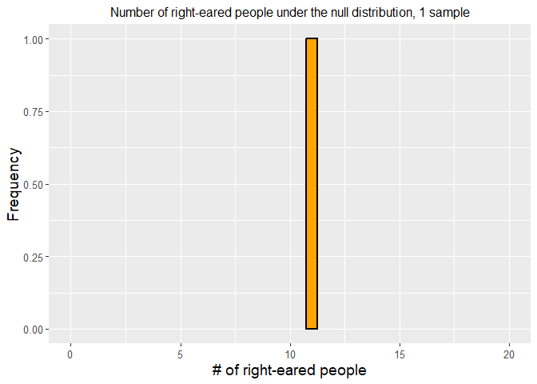
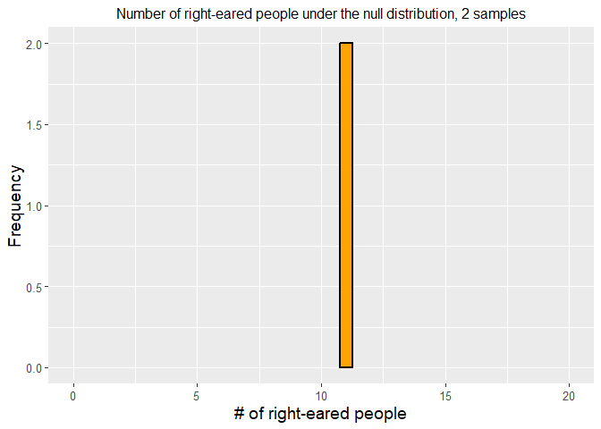
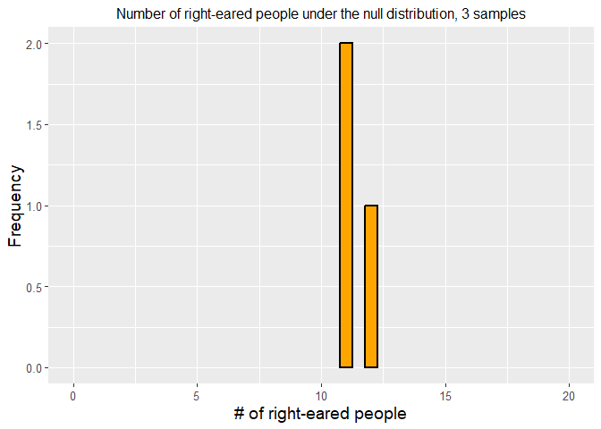
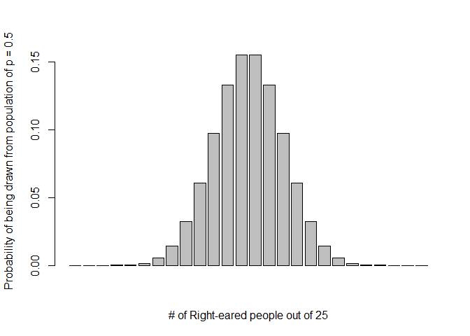
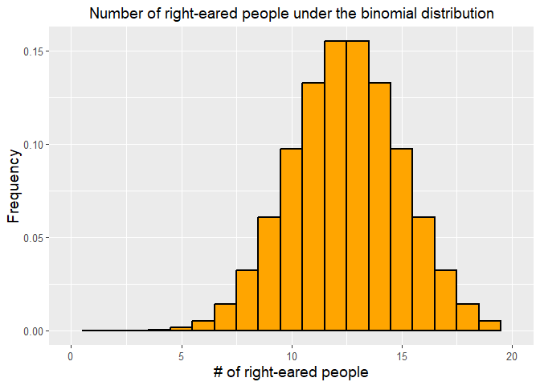

```r
require(binom)
require(ggplot2)
```

Before doing this, review the **Introduction To Hypothesis Testing Via Binomial Tests** lecture set slides from 
https://sites.google.com/view/biostats/lessons/hypothesis-testing-with-the-binomial-distribution and
the  **3_hypothesis_testing_and_binomial.R** script in the lecture_files folder of the
[CUNY-BioStats github repository](https://github.com/jsgosnell/CUNY-BioStats).  
**You should also complete the swirl tutorial**!


Remember you should

* add code chunks by clicking the *Insert Chunk* button on the toolbar or by
pressing *Ctrl+Alt+I* to answer the questions!
* **knit** your file to produce a markdown version that you can see!
* save your work often 
  * **commit** it via git!
  * **push** updates to github

## Hypothesis Testing and the Binomial Distribution

### Example

Using the bat paper from class (Geipel et al. 2021), let's consider how to analyze
data showing all 10 bats chose the walking over the motionless model.  


```r
binom.test(10,10)
```

```
## 
## 	Exact binomial test
## 
## data:  10 and 10
## number of successes = 10, number of trials = 10, p-value = 0.001953
## alternative hypothesis: true probability of success is not equal to 0.5
## 95 percent confidence interval:
##  0.6915029 1.0000000
## sample estimates:
## probability of success 
##                      1
```
We use the binom.test function. We only need arguments for # of succeses and #
of trials. By default it runs a 2-sided test against a null hypothesis value of 
p = .5. You can see how to update thee options by 
looking at the help file.


```r
?binom.test
```

```
## starting httpd help server ... done
```


Note the confidence interval is assymetric since its estimated to be 1! We can see
other options using the binom.confint function from the *binom* package.


```r
library(binom)
binom.confint(10,10)
```

```
##           method  x  n      mean     lower    upper
## 1  agresti-coull 10 10 1.0000000 0.6791127 1.043355
## 2     asymptotic 10 10 1.0000000 1.0000000 1.000000
## 3          bayes 10 10 0.9545455 0.8292269 1.000000
## 4        cloglog 10 10 1.0000000 0.6915029 1.000000
## 5          exact 10 10 1.0000000 0.6915029 1.000000
## 6          logit 10 10 1.0000000 0.6915029 1.000000
## 7         probit 10 10 1.0000000 0.6915029 1.000000
## 8        profile 10 10 1.0000000 0.7303058 1.000000
## 9            lrt 10 10 1.0000000 0.8252466 1.000000
## 10     prop.test 10 10 1.0000000 0.6554628 1.000000
## 11        wilson 10 10 1.0000000 0.7224672 1.000000
```

### Practice!

Make sure you are comfortable with null and alternative hypotheses for all examples.

#### 1

1. Are people eared (do they prefer one ear or another)?  Of 25 people observed 
while in conversation in a nightclub, 19 turned their right ear to the speaker 
and 6 turn their left ear to the speaker.  How strong is the evidence for 
eared-ness given this data (adapted from Analysis of Biological Data)?
* state a null and alternative hypothesis
* calculate a test statistic (signal) for this data
* Make you understand how to construct a null distribution
  + using sampling/simulation (code or written explanation)
  + by using an appropriate distribution (code or written explanation)
*Calculate and compare p-values obtained using 
  + simulation (calculation won’t be required on test, but make sure you understand!) (code or written explanation)
  + equations for binomial distribution (code or written explanation) 
  + R functions (required)(code)
* Calculate a 95% confidence interval for the proportion of people who are right-eared
* How do your 95% confidence interval and hypothesis test compare?

**Answer**

$H_{0}$: There **is no difference** in the number of people who prefer their left ear or their right ear.

$H_{A}$: There **is a difference** in the number of people who prefer their left ear or their right ear.


```r
binom.test(19, 25)
```

```
## 
## 	Exact binomial test
## 
## data:  19 and 25
## number of successes = 19, number of trials = 25, p-value = 0.01463
## alternative hypothesis: true probability of success is not equal to 0.5
## 95 percent confidence interval:
##  0.5487120 0.9064356
## sample estimates:
## probability of success 
##                   0.76
```

The probability of success, assuming *right-eared* is *success* and *left-eared* is failure, is (19/25) 0.76, or 76%.

**Simulation**


```r
#get 10000 samples
sampling_experiment = rbinom(10000, 25, 0.5)
sampling_experiment_df <- data.frame('Right_Handed' = sampling_experiment)
```

# plot 1####
#ggplot2 had issue with subset dataframe for bar, thus remade frame...


```r
ggplot(data.frame(Right_Handed = sampling_experiment_df[1,]), aes(Right_Handed)) + 
  geom_bar(size = 1, width = 0.5, fill = "orange", color = "black")+
  xlim(0, 20) +
  xlab("# of right-eared people")+
  ylab("Frequency")+
  ggtitle("Number of right-eared people under the null distribution, 1 sample")+
  theme(axis.title.x = element_text(size = 14), 
        axis.title.y = element_text(size = 14), 
        axis.text.y  = element_text(size = 10),
        axis.text.x  = element_text(size = 10), 
        legend.text =element_text(size = 10),
        legend.title = element_text(size = 10),
        legend.position = "bottom",
        plot.title = element_text(hjust = 0.5, size = 12))+
  guides(fill = F)
```

```
## Warning: The `<scale>` argument of `guides()` cannot be
## `FALSE`. Use "none" instead as of ggplot2 3.3.4.
```

<!-- -->


```r
# plot 2 ####

ggplot(data.frame(Right_Handed = sampling_experiment_df[1:2,]), aes(Right_Handed)) + 
  geom_bar(size = 1, width = 0.5, fill = "orange", color = "black")+
  xlim(0, 20) +
  xlab("# of right-eared people")+
  ylab("Frequency")+
  ggtitle("Number of right-eared people under the null distribution, 2 samples")+
  theme(axis.title.x = element_text(size = 14), 
        axis.title.y = element_text(size = 14), 
        axis.text.y  = element_text(size = 10),
        axis.text.x  = element_text(size = 10), 
        legend.text =element_text(size = 10),
        legend.title = element_text(size = 10),
        legend.position = "bottom",
        plot.title = element_text(hjust = 0.5, size = 12))+
  guides(fill = F)
```

<!-- -->


```r
# plot 3 ####

ggplot(data.frame(Right_Handed = sampling_experiment_df[1:3,]), aes(Right_Handed)) + 
  geom_bar(size = 1, width = 0.5, fill = "orange", color = "black")+
  xlim(0, 20) +
  xlab("# of right-eared people")+
  ylab("Frequency")+
  ggtitle("Number of right-eared people under the null distribution, 3 samples")+
  theme(axis.title.x = element_text(size = 14), 
        axis.title.y = element_text(size = 14), 
        axis.text.y  = element_text(size = 10),
        axis.text.x  = element_text(size = 10), 
        legend.text =element_text(size = 10),
        legend.title = element_text(size = 10),
        legend.position = "bottom",
        plot.title = element_text(hjust = 0.5, size = 12))+
  guides(fill = F)
```

<!-- -->


```r
# plot all ####

ggplot(sampling_experiment_df, aes(Right_Handed)) +
  geom_bar(size = 1, width = 0.5, fill = "orange", color = "black")+
  xlim(0, 20) +
  xlab("# of right-eared people")+
  ylab("Frequency")+
  ggtitle("Number of right-eared people under the null distribution, 10,000 sample")+
  theme(axis.title.x = element_text(size = 14), 
        axis.title.y = element_text(size = 14), 
        axis.text.y  = element_text(size = 10),
        axis.text.x  = element_text(size = 10), 
        legend.text =element_text(size = 10),
        legend.title = element_text(size = 10),
        legend.position = "bottom",
        plot.title = element_text(hjust = 0.5, size = 12))+
  guides(fill = F)
```

```
## Warning: Removed 6 rows containing non-finite values
## (`stat_count()`).
```

```
## Warning: Removed 1 rows containing missing values
## (`geom_bar()`).
```

<!-- -->


```r
#using the binomial distribution####
using_distribution = dbinom(0:25, 25, 0.5)
using_distribution
```

```
##  [1] 2.980232e-08 7.450581e-07 8.940697e-06 6.854534e-05 3.769994e-04
##  [6] 1.583397e-03 5.277991e-03 1.432598e-02 3.223345e-02 6.088540e-02
## [11] 9.741664e-02 1.328409e-01 1.549810e-01 1.549810e-01 1.328409e-01
## [16] 9.741664e-02 6.088540e-02 3.223345e-02 1.432598e-02 5.277991e-03
## [21] 1.583397e-03 3.769994e-04 6.854534e-05 8.940697e-06 7.450581e-07
## [26] 2.980232e-08
```

```r
sum(using_distribution)
```

```
## [1] 1
```

```r
Number_right_eared = c(0:25)
pdf = data.frame(Number_right_eared, using_distribution)
plot(0:25, using_distribution)
```

<!-- -->

```r
#for all plots, R takes a best guess at the best type of plot; you can also
#direct it with the type command.  ?plot for more info
```


```r
barplot(using_distribution, xlab = "# of Right-eared people out of 25", ylab = "Probability of being drawn from population of p = 0.5" )
```

<!-- -->


```r
ggplot(pdf, aes(x= Number_right_eared, y = using_distribution)) + 
  geom_bar(size=1, width = 1, fill="orange", color="black", stat = "identity")+
  xlim(0,20) +
  xlab("# of right-eared people")+
  ylab("Frequency")+
  ggtitle("Number of right-eared people under the binomial distribution")+
  theme(axis.title.x = element_text(size = 14), 
        axis.title.y = element_text(size = 14), 
        axis.text.y  = element_text(size = 10),
        axis.text.x  = element_text(size=10), 
        legend.text =element_text(size = 10),
        legend.title = element_text(size = 10, face="bold"),
        legend.position = "bottom",
        plot.title = element_text(hjust = 0.5, size = 14))+
  guides(fill = F)
```

```
## Warning: Removed 5 rows containing missing values
## (`position_stack()`).
```

```
## Warning: Removed 2 rows containing missing values
## (`geom_bar()`).
```

<!-- -->


```r
#probability of 14 or more####
(1-sum(dbinom(0:18, 25 , 0.5))) * 2
```

```
## [1] 0.0146333
```

```r
#multiply by 2 since symmetrical
#or
(1-pbinom(18, 25, 0.5)) * 2
```

```
## [1] 0.0146333
```

```r
#remember the one comes from the fact the entire distribution must sum to 1
#or
#using our sample
length(sampling_experiment[sampling_experiment >= 14 | sampling_experiment <= 4])/
  length(sampling_experiment)
```

```
## [1] 0.3446
```

```r
#binomial test####
binom.test(x = 19, n = 25, p = 0.5)
```

```
## 
## 	Exact binomial test
## 
## data:  19 and 25
## number of successes = 19, number of trials = 25, p-value = 0.01463
## alternative hypothesis: true probability of success is not equal to 0.5
## 95 percent confidence interval:
##  0.5487120 0.9064356
## sample estimates:
## probability of success 
##                   0.76
```

Take a coin and flip it 25 times, count Heads (Right-Eared) and Tails (Left-Eared), then repeat x10,000 times and get a distribution of proportions, Heads and Tails, or Right_Eared vs. Left-Eared.

**Equations**

If $p$ is the probability of success in any single trial then the probability
of $x$ successes in $n$ trials is
$$
   f(x) = \binom{n}{x} p^x (1 - p)^{n - x}, \qquad x = 0, 1, 2, \ldots, n.
$$
where
$$
   \binom{n}{x} = \frac{n!}{x! \, (n - x)!}
$$
is called a *binomial coefficient* and gives the distribution its name.
And this is the PMF of the *binomial distribution*.

The fact that probabilities sum to one is a special case of
the *binomial theorem*
$$
   \sum_{x = 0}^n \binom{n}{x} a^x b^{n - x} = (a + b)^n.
$$

The **p-value** is 0.01463. So, we reject the null hypothesis that there is no difference between the number of people who are *right-eared* and *left-eared*.

As above, using the function `binom.test`, the **95% confidence interval** is 0.5487120 to 0.9064356.

Also...


```r
binom.confint(19, 25)
```

```
##           method  x  n mean     lower     upper
## 1  agresti-coull 19 25 0.76 0.5624805 0.8882596
## 2     asymptotic 19 25 0.76 0.5925865 0.9274135
## 3          bayes 19 25 0.75 0.5854415 0.9037771
## 4        cloglog 19 25 0.76 0.5420481 0.8842776
## 5          exact 19 25 0.76 0.5487120 0.9064356
## 6          logit 19 25 0.76 0.5584422 0.8880044
## 7         probit 19 25 0.76 0.5666202 0.8934027
## 8        profile 19 25 0.76 0.5724026 0.8967715
## 9            lrt 19 25 0.76 0.5724301 0.8968455
## 10     prop.test 19 25 0.76 0.5447916 0.8984194
## 11        wilson 19 25 0.76 0.5657032 0.8850369
```

The **95% confidence interval** includes the 

#### 2

2.  A professor lets his dog take every multiple-choice test to see how it 
compares to his students (I know someone who did this).  Unfortunately, the
professor believes undergraduates in the class tricked him by helping the dog 
do better on a test. It’s a 100 question test, and every questions has 4 answer 
choices.  For the last test, the dog picked 33 questions correctly.  How likely
is this to happen, and is there evidence the students helped the dog?	

**MAKE SURE TO THINK ABOUT YOUR TEST OPTIONS**

**Answer**

$H_{0}$: There **is no difference** in test scores, considering whether the dog score by chance (25/100) or if the students helped the dog (33/100).

$H_{A}$: There **is a difference** in test scores, considering whether the dog scores by chance (25/100) or if the students helped the dog (33/100).

The probability of success, assuming *right-eared* is *success* and *left-eared* is failure, is (19/25) 0.76, or 76%.


```r
binom.test(33, 100, p = 0.25,
           alternative = c("two.sided"),
           conf.level = 0.95)
```

```
## 
## 	Exact binomial test
## 
## data:  33 and 100
## number of successes = 33, number of trials = 100, p-value = 0.08222
## alternative hypothesis: true probability of success is not equal to 0.25
## 95 percent confidence interval:
##  0.2391985 0.4311728
## sample estimates:
## probability of success 
##                   0.33
```


```r
binom.test(33, 100, p = 0.25,
           alternative = c("greater"),
           conf.level = 0.95)
```

```
## 
## 	Exact binomial test
## 
## data:  33 and 100
## number of successes = 33, number of trials = 100, p-value = 0.0446
## alternative hypothesis: true probability of success is greater than 0.25
## 95 percent confidence interval:
##  0.2523035 1.0000000
## sample estimates:
## probability of success 
##                   0.33
```
**Reject the null hypothesis** - *there is evidence* that the students helped the dog with the test.
